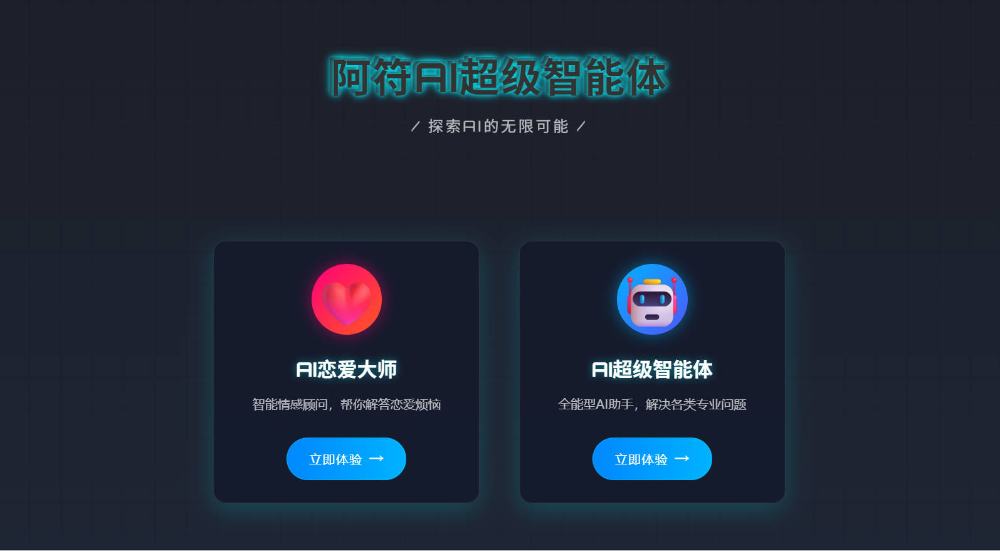
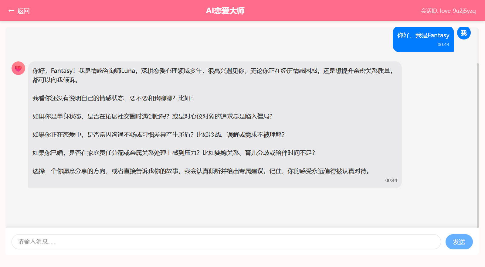

# 🤖 阿符AI Agent (rabbit AI Agent)

> 一个功能丰富的智能AI代理系统，集成多种AI服务和工具，提供强大的对话、RAG检索、工具调用等能力

[](https://spring.io/projects/spring-boot)
[](https://openjdk.java.net/)
[](https://vuejs.org/)
[](#)

## 📋 项目简介

本项目是一个基于Spring Boot 3.4.4和Java 21开发的智能AI Agent系统，集成了多种主流AI服务提供商的能力，包括阿里云百炼、火山引擎、Ollama等。系统提供了丰富的工具集成、RAG检索增强生成、对话管理、以及MCP协议支持等功能。

### ✨ 核心特性

- 🧠 **多AI服务集成**：支持阿里云百炼、火山引擎、Ollama等多种AI服务
- 🔧 **丰富工具集成**：内置邮件发送、PDF生成、网页搜索、文件操作等多种工具
- 📚 **RAG检索增强**：基于PGVector的向量存储，支持文档检索增强生成
- 💬 **智能对话管理**：支持多轮对话、对话历史管理、上下文保持
- 🔗 **MCP协议支持**：集成Model Context Protocol，支持扩展工具能力
- 🎯 **ReAct代理模式**：支持推理-行动循环的智能代理模式
- 🌐 **前后端分离**：Vue 3前端 + Spring Boot后端的现代化架构
- 📊 **数据持久化**：基于MySQL + MyBatis-Plus的数据存储方案

## 📱 效果图展示

### 系统界面截图





## 🛠️ 技术栈

### 后端技术栈
- **基础框架**：Spring Boot 3.4.4
- **开发语言**：Java 21
- **数据库**：MySQL + PostgreSQL (向量存储)
- **ORM框架**：MyBatis-Plus 3.5.12
- **AI集成**：Spring AI + 阿里云百炼 + 火山引擎 + Ollama
- **工具库**：Hutool、Lombok
- **API文档**：Knife4j
- **序列化**：Kryo
- **协议支持**：MCP (Model Context Protocol)

### 前端技术栈
- **前端框架**：Vue 3.4.29
- **路由管理**：Vue Router 4.3.0
- **HTTP客户端**：Axios 1.7.0
- **构建工具**：Vite 5.3.1

### AI服务集成
- **阿里云百炼**：DashScope SDK
- **火山引擎**：Volcengine SDK
- **本地模型**：Ollama集成
- **LangChain4j**：社区版DashScope支持

## 🏗️ 项目架构

```
rabbit-ai-agent/
├── src/main/java/com/fantasy/rabbitaiagent/
│   ├── agent/          # AI代理核心模块
│   ├── controller/     # REST API控制器
│   ├── service/        # 业务逻辑层
│   ├── mapper/         # 数据访问层
│   ├── tools/          # 工具集成模块
│   ├── rag/           # RAG检索增强模块
│   ├── config/        # 配置类
│   ├── model/         # 数据模型
│   └── utils/         # 工具类
├── rabbit-ai-agent-frontend/          # Vue 3前端项目
├── rabbit-image-search-mcp-server/    # MCP图像搜索服务器
└── src/main/resources/
    ├── application.yml    # 主配置文件
    ├── mcp-servers.json  # MCP服务器配置
    └── document/         # 文档资源
```

## 🚀 快速开始

### 环境要求

- Java 21+
- Node.js 16+
- MySQL 8.0+
- PostgreSQL 12+ (用于向量存储，可选)

### 1. 克隆项目

```bash
git clone https://github.com/777nx/rabbit-ai-agent.git
cd rabbit-ai-agent
```

### 2. 配置数据库

创建MySQL数据库并导入初始化脚本：

```sql
CREATE DATABASE ai_agent CHARACTER SET utf8mb4 COLLATE utf8mb4_unicode_ci;
```

### 3. 配置AI服务密钥

## 启动项目所需要的配置修改

将下面这段配置修改为自己的配置

```yaml
spring:
  datasource:
    mysql:
      driver-class-name: com.mysql.cj.jdbc.Driver
      url: jdbc:mysql://localhost:3306/ai_agent
      username: 改为你的用户名
      password: 改为你的密码
    postgres:
      url: jdbc:postgresql://改为你的公网地址/rabbit_ai_agent
      username: 改为你的用户名
      password: 改为你的密码
  ai:
    # 注意配置百炼的 api-key
    dashscope:
      api-key: your-api-key
      chat:
        options:
          model: qwen-plus
    # 配置 vectorstore 存储方式为 pgvector
    vectorstore:
      pgvector:
        index-type: HNSW
        dimensions: 1536
        distance-type: COSINE_DISTANCE
        max-document-batch-size: 10000 # Optional: Maximum number of documents per batch
```

```yaml
spring:
  # 邮件配置
  mail:
    host: smtp.qq.com
    port: 465
    username: 发件邮箱
    password: 邮箱授权码（非登录密码）
    properties:
      mail:
        smtp:
          auth: true
          starttls:
            enable: true
            required: true
          ssl:
            enable: true
          socketFactory:
            port: 465
            class: javax.net.ssl.SSLSocketFactory
```

```yaml
# searchApi
search-api:
  api-key: 你的 API Key
```

此类为测试代码使用的apikey，修改为自己的配置即可

```java
/**
 * 仅用于测试获取 API Key
 */
public interface TestApiKey {

    // 修改为你的 API Key
    String API_KEY = "修改为你的 API Key";

    // 修改为你的火山引擎 API Key
    String VOLCENGINE_KEY = "修改为你的火山引擎 API Key";
}
```

### 4. 启动后端服务

```bash
# 使用Maven启动
./mvnw spring-boot:run

# 或者构建后启动
./mvnw clean package
java -jar target/rabbit-ai-agent-0.0.1-SNAPSHOT.jar
```

### 5. 启动前端服务

```bash
cd rabbit-ai-agent-frontend
npm install
npm run dev
```

### 6. 访问应用

- 前端应用：http://localhost:3000
- 后端API：http://localhost:8123/api
- API文档：http://localhost:8123/api/swagger-ui.html

## 🔧 主要功能模块

### 1. AI对话服务
- 支持多轮对话
- 对话历史管理
- 上下文保持
- 多AI服务切换

### 2. 工具集成
- **邮件工具**：支持邮件发送功能
- **PDF生成**：将内容生成为PDF文档
- **网页搜索**：集成搜索引擎API
- **网页抓取**：获取网页内容
- **文件操作**：文件读写、上传下载
- **终端操作**：执行系统命令

### 3. RAG检索增强
- 文档向量化存储
- 语义相似度检索
- 上下文增强生成
- 支持多种文档格式

### 4. MCP协议支持
- 图像搜索MCP服务器
- 可扩展的工具协议
- 标准化的工具接口

## 📖 API文档

项目集成了Knife4j，启动后可访问以下地址查看完整的API文档：

- Swagger UI：http://localhost:8123/api/swagger-ui.html
- OpenAPI文档：http://localhost:8123/api/v3/api-docs

## 🔒 配置说明

### 数据库配置
```yaml
spring:
  datasource:
    mysql:
      driver-class-name: com.mysql.cj.jdbc.Driver
      url: jdbc:mysql://localhost:3306/ai_agent
      username: your_username
      password: your_password
```

### AI服务配置
```yaml
spring:
  ai:
    dashscope:
      api-key: your_dashscope_api_key
      chat:
        options:
          model: qwen-plus
```

### 向量存储配置
```yaml
spring:
  ai:
    vectorstore:
      pgvector:
        index-type: HNSW
        dimensions: 1536
        distance-type: COSINE_DISTANCE
```

## 🤝 贡献指南

欢迎提交Issue和Pull Request来改进项目！

## 📄 许可证

本项目仅用于个人学习使用，如有侵权请联系本人删除。

## 📞 联系方式

如有问题可留言，定期查看。

---

**注意**：本项目为学习项目，请确保在使用各种AI服务时遵守相应的服务条款和使用限制。
